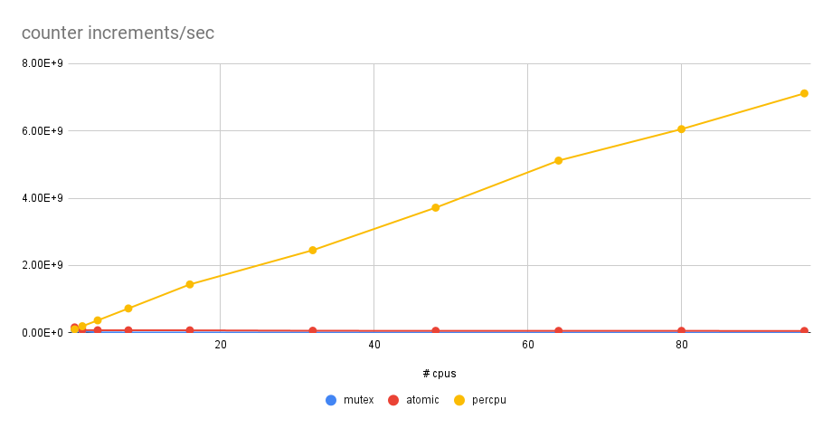

# percpu

Percpu is a Go package to support best-effort CPU-local sharded values.

This package is something of an experiment. See [Go issue #18802] for discussion
about adding this functionality into the Go standard library. I used an [API
suggested by Bryan Mills (@bcmills)][API] on that issue.

## IMPORTANT CAVEATS

* This package uses `go:linkname` to access unexported functions from inside the
  Go runtime. Those could be changed or removed in a future Go version, breaking
  this package.
* The code in this package assumes that `GOMAXPROCS` does not change. If the
  value of `GOMAXPROCS` changes (via a call to `runtime.GOMAXPROCS`) after
  creating a `Values`, then `Values.Get` may panic.
* It may be tempting to use this package to solve problems for which there are
  better solutions that do not break key abstractions of the runtime.

See [When to use percpu](using.md) for a discussion about when this package may
or may not be appropriate.

## Benchmarks

A best-case scenario for percpu is a shared counter being incremented as fast as
possible. This is exercised by the benchmark for `percpu.Counter`, which
compares the performance of `Counter` against a mutex-guarded integer and a
single atomically-incremented integer.

Below are the results (limiting the code to use 1, 2, 4, ..., 96 cores
on a 96-core machine) plotted as increments/sec.

With the mutex and the single atomic, adding more CPUs increases cache
contention and the total number of increments/sec goes down. By contrast, the
`percpu.Counter` scales up linearly in the number of CPUs. With all 96 CPUs,
`percpu.Counter` runs several orders of magnitude faster than the other
counters:

|        | total incs/sec | 1-goroutine inc latency | slowdown vs. `percpu.Counter` |
|--------|---------------:|------------------------:|------------------------------:|
| mutex  |           1.9M |                   50 μs |                         3727× |
| atomic |            49M |                  2.0 μs |                          145× |
| percpu |           7.1B |                 13.5 ns |                               |

[Go issue #18802]: https://github.com/golang/go/issues/18802
[API]: https://github.com/golang/go/issues/18802#issuecomment-275494801
